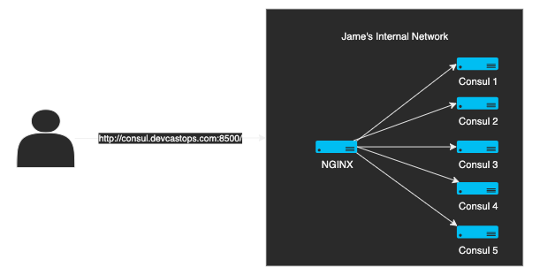

# consul-with-ansible

To Do:

    [x] Complete Encryption
    [x] remove old keys from key ring
    [x] run console info 

    - Setup Health checks
    [x] Service is running
    [x] Host in quorum
    [x] hit api endpoint for /health
    [x] Consul servce status
    [x] Make handlers for system restarts

    - SSL
    [x] Have ACL generate keys in a way to be flexible for the servers
    [x] Have ACL generate keys in a way to be flexible for the agents
    [] TLS - Setup HTTPS(https://developer.hashicorp.com/consul/tutorials/security/tls-encryption-secure)
        - completed server tls
        - https instructions: https://deliciousbrains.com/ssl-certificate-authority-for-local-https-development/
            - from pi-zero-1:
            - consul.devcastops.key
            - consul.devcastops.pem  
            - dco.pem 
        - Install CA in linux

    - Improvements:
    [] Make consul install idempotent
    [x] Diagram
    [] Bootstrap 

